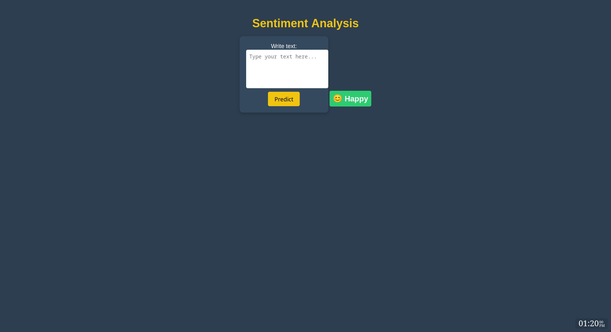

twitter-emotion-v3.0
==============================

A short description of the project.

Project Organization
------------

    ├── LICENSE
    ├── Makefile           <- Makefile with commands like `make data` or `make train`
    ├── README.md          <- The top-level README for developers using this project.
    ├── data
    │   ├── external       <- Data from third party sources.
    │   ├── interim        <- Intermediate data that has been transformed.
    │   ├── processed      <- The final, canonical data sets for modeling.
    │   └── raw            <- The original, immutable data dump.
    │
    ├── docs               <- A default Sphinx project; see sphinx-doc.org for details
    │
    ├── models             <- Trained and serialized models, model predictions, or model summaries
    │
    ├── notebooks          <- Jupyter notebooks. Naming convention is a number (for ordering),
    │                         the creator's initials, and a short `-` delimited description, e.g.
    │                         `1.0-jqp-initial-data-exploration`.
    │
    ├── references         <- Data dictionaries, manuals, and all other explanatory materials.
    │
    ├── reports            <- Generated analysis as HTML, PDF, LaTeX, etc.
    │   └── figures        <- Generated graphics and figures to be used in reporting
    │
    ├── requirements.txt   <- The requirements file for reproducing the analysis environment, e.g.
    │                         generated with `pip freeze > requirements.txt`
    │
    ├── setup.py           <- makes project pip installable (pip install -e .) so src can be imported
    ├── src                <- Source code for use in this project.
    │   ├── __init__.py    <- Makes src a Python module
    │   │
    │   ├── data           <- Scripts to download or generate data
    │   │   └── make_dataset.py
    │   │
    │   ├── features       <- Scripts to turn raw data into features for modeling
    │   │   └── build_features.py
    │   │
    │   ├── models         <- Scripts to train models and then use trained models to make
    │   │   │                 predictions
    │   │   ├── predict_model.py
    │   │   └── train_model.py
    │   │
    │   └── visualization  <- Scripts to create exploratory and results oriented visualizations
    │       └── visualize.py
    │
    └── tox.ini            <- tox file with settings for running tox; see tox.readthedocs.io


--------

<p><small>Project based on the <a target="_blank" href="https://drivendata.github.io/cookiecutter-data-science/">cookiecutter data science project template</a>. #cookiecutterdatascience</small></p>

# CI/CD Pipeline for Machine Learning Project

This repository contains a complete CI/CD pipeline for a machine learning project. It automates data ingestion, preprocessing, feature engineering, model building, evaluation, and deployment using DVC, GitHub Actions, Docker, and EC2.

## Table of Contents
- [Overview](#overview)
- [Workflow](#workflow)
- [Technologies Used](#technologies-used)
- [Pipeline Stages](#pipeline-stages)
- [Deployment](#deployment)
- [Usage](#usage)
- [Screenshots](#screenshots)
- [License](#license)

## Overview
This project follows a structured MLOps approach by leveraging:
- **DVC** for tracking machine learning workflows and data versioning
- **GitHub Actions** for continuous integration and testing
- **Docker** for containerizing the application
- **AWS EC2** for deployment

## Workflow
The pipeline is triggered on every push to the repository. It follows these steps:
1. **Code Checkout** - Fetches the latest code from GitHub.
2. **Setup Python** - Installs dependencies and caches them for faster execution.
3. **Run Pipeline** - Uses `dvc repro` to run the ML pipeline.
4. **Model Testing** - Runs unit tests on the trained model.
5. **Promote Model to Production** - Deploys the best model.
6. **Run Flask App Tests** - Ensures the API is working correctly.
7. **Build & Push Docker Image** - Creates a Docker image and pushes it to Docker Hub.
8. **Deploy to EC2** - Pulls the latest Docker image and runs it on AWS EC2.

## Technologies Used
- **Python (3.10)**
- **DVC (Data Version Control)**
- **GitHub Actions**
- **Docker & Docker Hub**
- **AWS EC2**
- **Flask**
- **Unittest for testing**

## Pipeline Stages
The following are the machine learning pipeline stages defined in `dvc.yaml`:

### 1. Data Ingestion
- Loads raw data and splits it into training and testing sets.
- Stores data in `data/raw/`.

### 2. Data Preprocessing
- Cleans and processes the raw data.
- Stores results in `data/interim/`.

### 3. Feature Engineering
- Extracts relevant features for training.
- Outputs processed data to `data/processed/`.

### 4. Model Building
- Trains a machine learning model.
- Saves the trained model in `models/model.pkl`.

### 5. Model Evaluation
- Evaluates the model's performance.
- Generates reports (`reports/metrics.json`).

### 6. Model Registration
- Registers the best-performing model.

## Deployment
### Docker Image Build & Push
The CI pipeline builds a Docker image and pushes it to Docker Hub:
```sh
docker build -t <DOCKER_HUB_USERNAME>/emotion1v2:latest .
docker push <DOCKER_HUB_USERNAME>/emotion1v2:latest
```

### EC2 Deployment
On deployment, the pipeline:
- Pulls the latest image from Docker Hub.
- Stops and removes any previous container.
- Runs the new container with environment variables.
```sh
docker pull <DOCKER_HUB_USERNAME>/emotion1v2:latest
docker stop my-app || true
docker rm my-app || true
docker run -d --restart always -p 80:5000 --name my-app \
  -e DAGSHUB_PAT=${{ secrets.DAGSHUB_PAT }} \
  <DOCKER_HUB_USERNAME>/emotion1v2:latest
```

## Usage
To manually run the ML pipeline:
```sh
dvc repro
```
To test the model:
```sh
python -m unittest tests/test_model.py
```
To test the Flask app:
```sh
python -m unittest tests/test_flask_app.py
```

## Screenshots


## License
This project is licensed under the MIT License.


